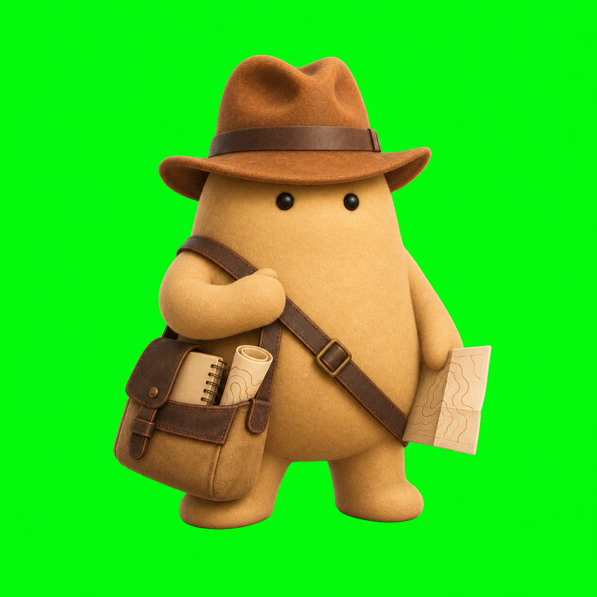

<p align="center">
  
</p>

<h1 align="center">Indiana Jones</h1>

<p align="center">
  <strong>Ask what might be hidden in a place. Follow the evidence until the story becomes testable.</strong>
</p>

Indiana Jones is a Codex plugin from [Kits Software](https://github.com/kits-software)
for exploring forgotten histories and making responsible archaeological
discoveries. Give it a place, a photograph, a local story, or a question about
how people once lived. It works out which evidence can help, searches for
connections and candidate locations, challenges its own ideas, and explains
what is most plausible.

You do not need to ask for a particular map, sensor, archive, model, or research
method. Start with the mystery.

> “An old castle is said to have stood somewhere around this valley. Where
> could it plausibly have been, and what evidence would prove or disprove each
> possibility?”

> “How did people live, build, farm, and travel around this village between
> 1200 and 1500?”

> “This ring-shaped mark appears in a field. What are the archaeological,
> natural, and modern explanations—and which one best fits the evidence?”

> “Show me how this harbour city and the people working on its quays could have
> looked around 120 CE, and tell me which parts of the illustration are known,
> inferred, or invented.”

## Why we are building it

The history of a place rarely survives in one neat record. It is scattered
across the shape of streets and fields, old names, maps, excavation reports,
museum catalogues, aerial photographs, terrain, geology, community memory, and
the gaps between them.

Professional archaeology already works by bringing those forms of evidence
together. Historic England describes landscape research as a way to understand
how people settled, farmed, built, travelled, and buried their dead, while the
Chartered Institute for Archaeologists treats maps, imagery, geology, archives,
records, museums, landowners, and local knowledge as complementary sources.
Indiana Jones turns that multidisciplinary practice into an accessible research
companion.

The goal is not to produce a dramatic answer from one striking image. The goal
is to keep investigating until we have:

- a useful account of what may have happened;
- ranked, source-backed hypotheses or candidate areas;
- strong natural and modern alternatives;
- an honest statement of what is still unknown; and
- the next observation, source, specialist, or non-invasive test that could
  change the conclusion.

## What it can help discover

| Your question | What Indiana Jones tries to return |
| --- | --- |
| “Could an older castle or settlement be hidden here?” | Plausible zones, competing site models, supporting and contradicting evidence, and discriminating next checks |
| “How did people live in this area?” | A time-sliced account of water, routes, fields, resources, buildings, work, belief, conflict, and daily life |
| “Why is this town shaped this way?” | A reconstruction of streets, plots, boundaries, institutions, lost features, and phases of growth |
| “Can you show me how it looked?” | An attractive, evidence-led illustration with the exact time and place, source-linked visual choices, anachronism checks, alternatives, and a clear uncertainty caption |
| “Does this unusual mark mean anything?” | Direct observations, archaeological interpretations, natural and modern alternatives, and a ranked judgment |
| “Is the local story true?” | Name variants, documentary chains, landscape fit, contradictions, missing evidence, and a bounded conclusion |
| “Where should we look next?” | An ordered research frontier that favors informative, lawful, non-invasive checks |

## Discovery first, evidence always

Indiana Jones is expected to find things: overlooked records, relationships
between landscape and history, plausible locations, repeated patterns, and
candidate features that deserve closer study. It should not retreat into a list
of tools or stop merely because one source is unavailable.

When an exact location or field action would be unsafe, unlawful, or harmful,
the investigation continues at a responsible scale. It can still search public
records, reconstruct the historical landscape, compare hypotheses, identify
the missing permission, and prepare a useful handoff for a landowner,
archaeologist, community body, museum, or heritage authority.

That persistence has hard boundaries:

- an anomaly is a candidate, not a discovery claim;
- no permission is inferred for access, detecting, collection, flying,
  probing, or excavation;
- precise locations of possible new, sacred, burial-related, vulnerable, or
  non-public sites are protected;
- public and authorized sources are attributed, and their licences determine
  how they may be analyzed or reproduced;
- local and descendant communities are research partners and knowledge
  holders, not obstacles to route around; and
- looting, trespass, covert investigation, and evasion of heritage law are
  never part of the workflow.

## How an investigation works

1. **Understand the mystery.** Resolve the place, time range, story, and what a
   useful answer would change.
2. **Reconstruct the landscape.** Ask how terrain, water, routes, resources,
   authority, and later disturbance shaped what could have existed.
3. **Search across evidence.** Combine suitable public or authorized records,
   maps, imagery, terrain, publications, catalogues, and local knowledge.
4. **Make explanations compete.** Test archaeological ideas against geology,
   agriculture, drainage, infrastructure, image artefacts, folklore, and
   inherited assumptions.
5. **Return a discovery packet.** Separate observations, derived results,
   interpretations, alternatives, corroboration, uncertainty, and next steps.
6. **Illustrate when useful.** Turn stable research into a source-linked visual
   brief, generate and inspect the reconstruction, and label what is
   documented, inferred, comparative, illustrative, or contested.
7. **Keep going responsibly.** If one route is blocked, pursue another lawful
   source or reduce location precision instead of abandoning the question.

Behind the simple conversation is a provider-neutral research system with
place resolution, historical time slices, adaptive search areas, evidence and
task graphs, provenance ledgers, source-sensitive disclosure, terrain and
multi-date optical baselines, map rendering, and reporting workflows.

Generated reconstruction art is a derived interpretation, never documentary
evidence or independent corroboration. The plugin preserves the sources,
visible decisions, alternatives, exact prompt, and review notes beside the
image so visual realism cannot silently become historical certainty.

## Install

Add this repository as a Codex plugin marketplace, then install the plugin:

```bash
codex plugin marketplace add kits-software/indiana-jones --ref main
codex plugin add indiana-jones@indiana-jones-lab
```

Start a new Codex task after installation so the bundled skills are loaded.
In the desktop app, you can also open **Plugins**, select **Indiana Jones Lab**,
and install **Indiana Jones**.

For local development:

```bash
git clone https://github.com/kits-software/indiana-jones.git
cd indiana-jones
codex plugin marketplace add .
codex plugin add indiana-jones@indiana-jones-lab
```

## What is real today

This is an experimental `0.1.0` release. Its strongest capability today is
structured, source-backed research: turning an ordinary question into a
multidisciplinary investigation, preserving uncertainty, and producing a
clear next step.

The repository also includes transparent Python baselines for terrain and
multi-date optical analysis. They are deliberately not marketed as magical
“lost city detectors.” In a known-site Whitley Castle terrain development
test, the target ranked 8th with 16.125 m error. A frozen Sentinel-2 optical
test missed its 160 m criterion, with the nearest anomaly 191.150 m away. We
publish both results because an honest miss teaches more than a hidden one.

See the [technical plugin README](plugins/indiana-jones/README.md) for runtime
requirements, tests, proof-of-concept details, and the full implementation map.

## Research foundations

The project’s public positioning and operating rules draw on:

- [Historic England: Archaeological Landscapes](https://historicengland.org.uk/research/current/discover-and-understand/landscapes/)
- [CIfA: Standard and guidance for archaeological desk-based assessment](https://www.archaeologists.net/sites/default/files/CIfAS%26GDBA_4.pdf)
- [Historic England: Aerial Investigation and Mapping](https://historicengland.org.uk/research/methods/airborne-remote-sensing/aerial-investigation/)
- [Historic England: Using Airborne Lidar in Archaeological Survey](https://historicengland.org.uk/research/methods/airborne-remote-sensing/lidar/)
- [Historic England: Formation of Cropmarks](https://historicengland.org.uk/research/methods/airborne-remote-sensing/formation-of-cropmarks/)
- [UNESCO: Recommendation on the Historic Urban Landscape](https://whc.unesco.org/en/hul/)
- [The London Charter for computer-based cultural heritage visualization](https://londoncharter.org/principles.html)
- [The Seville Principles for virtual archaeology](https://www.vi-mm.eu/wp-content/uploads/2016/10/The-Seville-Principles.pdf)
- [ICOMOS Charter for Interpretation and Presentation](https://www.icomos.org/images/DOCUMENTS/Charters/interpretation_e_1.pdf)
- [ANSI/ASB Best Practice Recommendation 089 for facial approximation](https://www.aafs.org/sites/default/files/media/documents/BPR_089_e1.pdf)
- [Archaeology Data Service: Sensitive Data](https://archaeologydataservice.ac.uk/help-guidance/how-to-prepare-data/sensitive-data/)
- [UNESCO: International principles applicable to archaeological excavations](https://www.unesco.org/en/legal-affairs/recommendation-international-principles-applicable-archaeological-excavations)

## Repository map

- [`plugins/indiana-jones`](plugins/indiana-jones) — installable Codex plugin
- [`.agents/plugins/marketplace.json`](.agents/plugins/marketplace.json) —
  repository marketplace entry
- [`plugins/indiana-jones/skills`](plugins/indiana-jones/skills) — discovery,
  planning, historical research, evidence, reconstruction illustration, and
  reporting workflows
- [`plugins/indiana-jones/rfcs`](plugins/indiana-jones/rfcs) — research and
  architecture decisions
- [`CONTRIBUTING.md`](CONTRIBUTING.md) — contribution and validation guide
- [`SECURITY.md`](SECURITY.md) — software and sensitive-location reporting

## Contributing

Contributions are welcome, especially from archaeologists, historians,
geospatial researchers, museum and archive professionals, heritage
practitioners, local-history groups, and engineers who care about reproducible
evidence. Please read [CONTRIBUTING.md](CONTRIBUTING.md) before opening a pull
request.

If a report may reveal a vulnerable location, do not post the coordinates,
route, imagery crop, or reversible locator in a public issue. Follow
[SECURITY.md](SECURITY.md) instead.

---

Indiana Jones is an independent, unofficial project. It is not affiliated with
or endorsed by Lucasfilm Ltd., Disney, or their affiliates.
