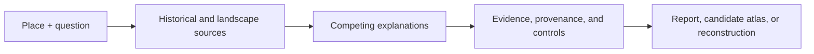

<p align="center">
  
</p>

<h1 align="center">Indiana Jones</h1>

<p align="center">
  <strong>Archaeological and historical research for Codex, starting with a place and a question.</strong>
</p>

<p align="center">
  <a href="#install">
    
  </a>
</p>

<p align="center">
  <a href="plugins/indiana-jones/README.md#runtime"></a>
  <a href="plugins/indiana-jones/.codex-plugin/plugin.json"></a>
  <a href="CITATION.cff"></a>
  <a href="SECURITY.md"></a>
  <a href="https://github.com/kits-software/indiana-jones/commits/main"></a>
</p>

<p align="center">
  <a href="#install">Install</a> ·
  <a href="#example-questions">Examples</a> ·
  <a href="#method">Method</a> ·
  <a href="#research-foundations">Research</a> ·
  <a href="#citation">Cite</a>
</p>

<p align="center">
  Created, maintained, and published by
  <a href="https://github.com/kliymkoffsky"><strong>Paweł Klimkowski</strong></a>.
</p>

---

Indiana Jones is a Codex plugin for investigating the archaeology and history
of a place. Ask where a lost building may have stood, how a settlement changed,
why a mark appears in a field, what an object can tell us, or how people lived
at a particular time.

The plugin selects the relevant methods behind the scenes. It searches public
or authorized evidence, records where each claim came from, compares
archaeological interpretations with natural and modern explanations, and
reports what is documented, plausible, disputed, or still untested.

**You do not need to name a map, archive, sensor, model, or specialist tool.**
Describe the place and the problem.

## Install

Register this repository as a Codex plugin marketplace, then install the
plugin:

```bash
codex plugin marketplace add kits-software/indiana-jones --ref main
codex plugin add indiana-jones@indiana-jones-lab
```

Start a new Codex task after installation so the plugin skills are loaded. In
the desktop app, open **Plugins**, choose **Indiana Jones Lab**, and select
**Indiana Jones**.

<details>
<summary><strong>Local development installation</strong></summary>

```bash
git clone https://github.com/kits-software/indiana-jones.git
cd indiana-jones
codex plugin marketplace add .
codex plugin add indiana-jones@indiana-jones-lab
```

</details>

## Example questions

| Investigate a place | Reconstruct life |
| --- | --- |
| “An old castle is said to have stood somewhere in this valley. Where could it plausibly have been, and what evidence would distinguish the possibilities?” | “How did people build, farm, work, and travel around this village between 1200 and 1500?” |

| Explain a trace | Reconstruct a scene |
| --- | --- |
| “This circular mark appears in a field. What archaeological, geological, agricultural, or modern processes could explain it?” | “What could this harbour and the people working on its quays have looked like around 120 CE? Mark what is documented, inferred, comparative, or illustrative.” |

| Trace finds | Investigate a reported hoard |
| --- | --- |
| “Which swords have been documented near this town, where are they now, and how reliable are their find records?” | “A local story says gold objects were once found in this county. Which records support it, what is missing, and what could be checked next without disturbing the site?” |

Other useful starting points include a photograph, an object, a building, an
old route, a town plan, a place-name, a museum record, or a disputed local
story.

### What a useful answer should contain

- the place, period, and research question as understood;
- direct observations and attributed documentary evidence;
- the strongest interpretation and serious alternatives;
- uncertainty, source limitations, and sensitive-location handling;
- the next lawful, non-invasive check most likely to change the conclusion;
- a source-linked reconstruction when a visual answer is useful.

## What the plugin covers

| Historical research | Landscape analysis | Reporting and reconstruction |
| --- | --- | --- |
| Place-names, maps, archives, publications, museum catalogues, objects, finds, custody, trade, and local accounts | Terrain, aerial photography, multi-date optical imagery, LiDAR/DEM products, urban form, routes, water, geology, land use, and disturbance | Evidence registers, competing hypotheses, candidate atlases, annotated plates, public-safe reports, historical narratives, and uncertainty-labelled illustrations |

The complete implementation includes six Codex skills, reproducible Python
utilities, an optional Node/MapLibre renderer, evidence and task graphs,
provenance records, and disclosure controls. See the
[technical plugin README](plugins/indiana-jones/README.md) for the architecture,
runtime requirements, tests, and proof-of-concept notes.

## Method



An investigation follows five rules:

1. **Resolve the question before searching.** Identify the place, time range,
   ambiguity, and decision the research should support.
2. **Search across disciplines.** Combine records, maps, imagery, terrain,
   material evidence, environmental context, and community knowledge when
   they are relevant and available.
3. **Make explanations compete.** Test archaeological interpretations against
   geology, agriculture, drainage, infrastructure, image artefacts, and later
   disturbance.
4. **Keep the evidence chain visible.** Separate source observations, derived
   measurements, interpretations, alternatives, and corroboration.
5. **Report the boundary of knowledge.** State what is not known and what
   evidence would materially change the assessment.

## Responsible discovery

A pattern, anomaly, or historical association is a **candidate**, not proof of
an archaeological site. Indiana Jones can identify plausible relationships and
places worth further professional study, but it must not turn visual
similarity into certainty.

- No permission is inferred for access, detecting, collection, flying,
  probing, or excavation.
- Precise locations of possible new, sacred, burial-related, vulnerable, or
  non-public sites are protected.
- Sources and transformations remain attributed, and their licences control
  reuse.
- Local and descendant communities are research partners and knowledge
  holders.
- Generated reconstruction art is interpretation, not documentary evidence
  or independent corroboration.
- Looting, trespass, covert investigation, and evasion of heritage law are
  outside the project.

Read [`SECURITY.md`](SECURITY.md) before reporting a potentially vulnerable
location.

## Project status

Indiana Jones is an **experimental version 0.1.0**. Today it can investigate a
place across public or explicitly authorized sources, preserve an auditable
evidence trail, and prepare public-safe reports. Exact prospectivity work
remains permission-gated. The repository also contains transparent terrain and
multi-date optical baselines; these are research prototypes, not general-purpose
“lost site detectors.”

| Public development test | Result | Interpretation |
| --- | --- | --- |
| Whitley Castle terrain baseline | Target ranked 8th; 16.125 m error | Passed its development criterion, but the winning profile was selected after unblinding and is not held-out proof |
| Whitley Castle Sentinel-2 optical baseline | Nearest anomaly 191.150 m away | Missed the precommitted 160 m criterion; the negative result remains published |

Detailed provenance, criteria, and caveats are in the
[terrain](plugins/indiana-jones/skills/indiana-jones/references/poc-whitley-castle.md)
and
[optical](plugins/indiana-jones/skills/indiana-jones/references/poc-whitley-castle-optical.md)
proof-of-concept reports.

## Research foundations

The method is grounded in published archaeological remote-sensing research,
landscape interpretation, professional standards, and cultural-heritage
visualization principles. The following are selected foundations, not anonymous
web links.

### Scholarly works

| Author(s) | Publication | Contribution to the project |
| --- | --- | --- |
| Sarah H. Parcak (2009) | [*Satellite Remote Sensing for Archaeology*](https://doi.org/10.4324/9780203881460). Routledge. | Landscape-to-site satellite prospection and interpretation |
| Rachel S. Opitz and David C. Cowley, eds. (2013) | [*Interpreting Archaeological Topography: 3D Data, Visualisation and Observation*](https://www.oxbowbooks.com/9781842175163/interpreting-archaeological-topography/). Oxbow Books. | LiDAR, topographic evidence, 3D data, and interpretive practice |
| Žiga Kokalj and Ralf Hesse (2017) | [*Airborne Laser Scanning Raster Data Visualization: A Guide to Good Practice*](https://doi.org/10.3986/9789612549848). ZRC SAZU. | Reproducible visualization of archaeological terrain |
| Ralf Hesse (2010) | [“LiDAR-derived Local Relief Models—a new tool for archaeological prospection”](https://doi.org/10.1002/arp.374). *Archaeological Prospection* 17. | Local-relief modelling and its interpretive limits |
| Rebecca Bennett, Kate Welham, Ross A. Hill, and Andrew Ford (2012) | [“A Comparison of Visualization Techniques for Models Created from Airborne Laser Scanned Data”](https://doi.org/10.1002/arp.1414). *Archaeological Prospection* 19. | Comparison rather than reliance on one terrain visualization |
| Włodzimierz Rączkowski (2020) | [“Power and/or Penury of Visualizations: Some Thoughts on Remote Sensing Data and Products in Archaeology”](https://doi.org/10.3390/rs12182996). *Remote Sensing* 12. | The non-neutrality of acquisition, processing, and visualization |
| Justyna Kolenda and Włodzimierz Rączkowski (2018) | [“Anatomia pustki: o archeologicznym rekonesansie lotniczym w północno-wschodniej części Dolnego Śląska”](https://doi.org/10.23858/PA66.2018.012). *Przegląd Archeologiczny* 66. | Why non-detection may reflect method and evidence opportunity rather than past absence |

### Professional and ethical standards

| Responsible author or institution | Standard |
| --- | --- |
| Chartered Institute for Archaeologists (2020) | [*Standard and guidance for historic environment desk-based assessment*](https://www.archaeologists.net/sites/default/files/2023-11/CIfA-SandG-DBA-2020.pdf) |
| Elaine Jamieson, based on work by Stewart Ainsworth, Mark Bowden, David McOmish, and Trevor Pearson (2017) | [*Understanding the Archaeology of Landscapes: A Guide to Good Recording Practice*, 2nd ed.](https://historicengland.org.uk/images-books/publications/understanding-archaeology-of-landscapes/) Historic England Guidance HEAG142. |
| Simon Crutchley and Peter Crow (2018) | [*Using Airborne Lidar in Archaeological Survey: The Light Fantastic*](https://historicengland.org.uk/images-books/publications/using-airborne-lidar-in-archaeological-survey/) Historic England Guidance HEAG179. |
| Historic England (2026) | [*Standards and Guidance for Aerial Investigation and Mapping Projects*](https://historicengland.org.uk/images-books/publications/standards-guidance-aerial-investigation-mapping-projects/) Historic England Guidance HEAG337. |
| UNESCO General Conference (2011) | [*Recommendation on the Historic Urban Landscape*](https://www.unesco.org/en/legal-affairs/recommendation-historic-urban-landscape-including-glossary-definitions) |
| Hugh Denard, ed. (2009) | [*The London Charter for the Computer-based Visualisation of Cultural Heritage*, version 2.1](https://londoncharter.org/) |
| Archaeology Data Service | [*Sensitive Data* guidance](https://archaeologydataservice.ac.uk/help-guidance/how-to-prepare-data/sensitive-data/) |
| Stephanie Russo Carroll, Ibrahim Garba, Oscar L. Figueroa-Rodríguez, et al. (2020) | [“The CARE Principles for Indigenous Data Governance”](https://doi.org/10.5334/dsj-2020-043). *Data Science Journal* 19:43. |

The
[complete source register](plugins/indiana-jones/skills/indiana-jones/references/research.md#source-register)
includes books, technical specifications, authorities, and primary evaluation
studies with DOI or institutional links.

## Citation

Indiana Jones is created and published by **Paweł Klimkowski**. If it
contributes to research, teaching, software, or a publication, cite:

> Klimkowski, Paweł. (2026). *Indiana Jones: Evidence-Led Archaeological
> Discovery for Codex* (Version 0.1.0) [Computer software]. Paweł Klimkowski.
> https://github.com/kits-software/indiana-jones

GitHub exposes the same authorship through **Cite this repository**, backed by
[`CITATION.cff`](CITATION.cff).

<details>
<summary><strong>BibTeX</strong></summary>

```bibtex
@software{klimkowski2026indianajones,
  author = {Paweł Klimkowski},
  title = {Indiana Jones: Evidence-Led Archaeological Discovery for Codex},
  year = {2026},
  publisher = {Paweł Klimkowski},
  version = {0.1.0},
  url = {https://github.com/kits-software/indiana-jones}
}
```

</details>

## Repository guide

| Path | Purpose |
| --- | --- |
| [`plugins/indiana-jones`](plugins/indiana-jones) | Installable Codex plugin and technical documentation |
| [`plugins/indiana-jones/skills`](plugins/indiana-jones/skills) | Discovery, planning, research, reporting, and reconstruction workflows |
| [`plugins/indiana-jones/rfcs`](plugins/indiana-jones/rfcs) | Research and architecture decisions |
| [`CONTRIBUTING.md`](CONTRIBUTING.md) | Development workflow and validation commands |
| [`SECURITY.md`](SECURITY.md) | Software vulnerabilities and sensitive-location reporting |
| [`CITATION.cff`](CITATION.cff) | Machine-readable author and citation metadata |

Contributions from archaeologists, historians, geospatial researchers, museum
and archive professionals, heritage practitioners, local-history groups, and
engineers are welcome. Read [`CONTRIBUTING.md`](CONTRIBUTING.md) before opening
a pull request.

---

Indiana Jones is an independent, unofficial project. It is not affiliated with
or endorsed by Lucasfilm Ltd., Disney, or their affiliates.
